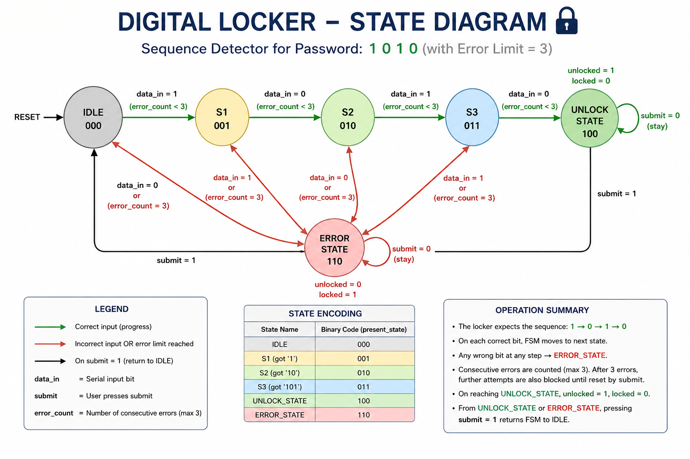
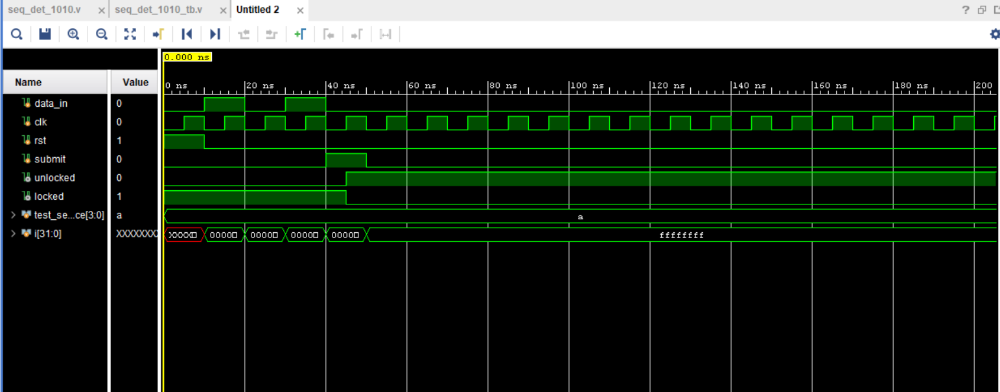

# Digital-Locker-using-Verilog

This repository contains a Verilog implementation of a synchronous **1010 sequence detector** acting as a digital lock system. The design processes a serial input bitstream, tracks incorrect attempts, and provides outputs for system locking/unlocking.

## Features
* **PASSWORD:** `1010`
* **Error Tracking:** Automatically tracks consecutive wrong password inputs. Lockout occurs after 3 failed attempts.
* **Synchronous Reset:** System can be completely reset to the `idle` state at any time.
* **Submit Control:** A `submit` flag handles transitions out of the authorized or error states back to `idle`.

---

## State Diagram

The Finite State Machine (FSM) operates using the following state transitions to securely track the sequence bit-by-bit:

* **idle:** Waiting for the correct starting bit (`1`).
* **S1 -> S2 -> S3:** Tracks the sequence progression. Any wrong bit routes the FSM to the `error_state`.
* **unlock_state:** Reached when the full `1010` password matches safely.
* **error_state:** Reached upon incorrect bit input. If `error_count >= 3`, retries are blocked until a hardware reset (`rst`) occurs.

---

## Simulation Waveforms

The testbench feeds the correct `1010` sequence into the module using an automated `for` loop, asserting the `submit` signal on the final cycle. 

### Key Waveform Observations:
1. **Sequence Entry:** On successive clock cycles, `data_in` transitions through `1 -> 0 -> 1 -> 0`.
2. **Unlock Trigger:** Once the final `0` is sampled alongside `submit`, the design transitions cleanly into `unlock_state`.
3. **Output Hold:** `unlocked` transitions to `1` (and `locked` drops to `0`) and remains latched because `submit` returns to `0` before the next evaluation edge.

---

## Files in this Project

* `seq_det_1010.v` - The core FSM design module featuring split sequential and combinational block logic.
* `seq_det_1010_tb.v` - Testbench utilizing a `for` loop to stream vectors at the negative edge of the clock for clean timing margin safety.
